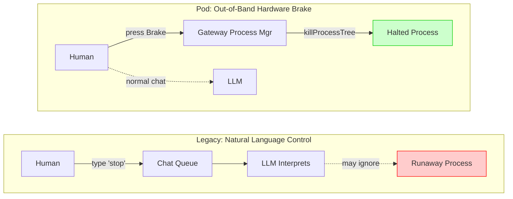
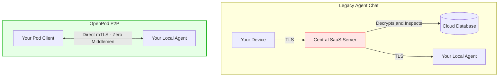
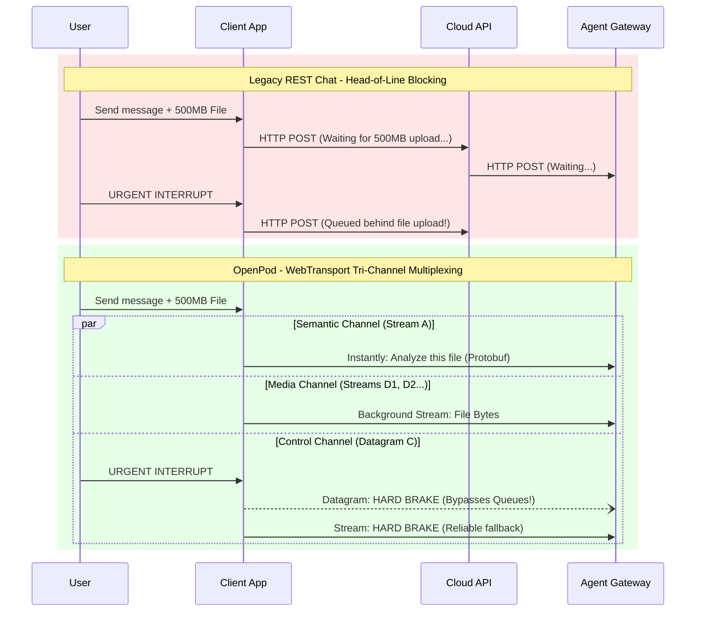
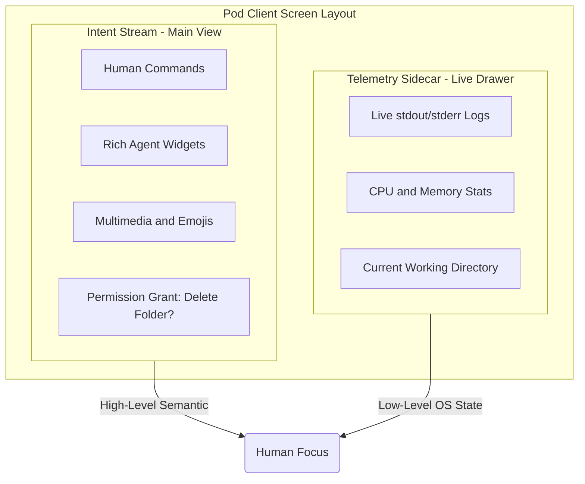

# OpenPod 🪐

**The Swarm Interface — Functional SSH for Agentic AI**

OpenPod (Project Pod) is a native Peer-to-Peer (P2P), User-to-Agent (U2A) communication protocol and client.

**Pod is not an AI orchestration framework.** We do not write prompt chains or manage LLM context windows. Pod is strictly a secure, ultra-efficient UI and transport layer. The Agent Gateway (e.g., OpenClaw) handles all reasoning; Pod provides the encrypted pipes and the specialized glass to view them safely.

---

## Why OpenPod?

Current messaging apps were designed for _humans talking to humans_. Agents are autonomous operating systems executing code, modifying files, and navigating networks. You don't manage a remote Linux server via WhatsApp or a SaaS web chat.

**Managing agents via consumer chat interfaces leads to three critical failures:**

1. **Security:** Relying on natural language ("Please stop") to control an autonomous process, and routing sensitive local data through centralized cloud servers that can decrypt and inspect it.
2. **Efficiency:** Forcing high-frequency machine telemetry, terminal logs, and multi-gigabyte files through slow REST/JSON bottlenecks, causing head-of-line blocking.
3. **Richness:** Cramming multi-dimensional machine state (CPU usage, process trees, working directories) into a single 1-dimensional conversational chat thread.

OpenPod fixes this by ruthlessly optimizing for three core objectives. We don't just tell you why it's better; we visualize the difference.

---

## 1. Security: The Sovereign Lock

Agents run on your machine and have access to your files. Security cannot rely on natural language ("Stop") or centralized cloud routers. Pod operates exclusively Peer-to-Peer with native End-to-End Encryption (mTLS over WebTransport).

### Passthrough Control: OOB Brake vs Natural Language

In a legacy agent framework, your "stop" command is just another chat message. It enters the same queue as every other message, gets interpreted by the LLM, and the LLM _decides_ whether to comply. Pod's Brake button is an Out-of-Band (OOB) hardware interrupt — it bypasses the LLM entirely and sends a `killProcessTree` signal directly to the Agent Gateway's process manager via a dedicated QUIC control channel.



### Network Topology: P2P Sovereignty vs Cloud MITM

Pod has no central routing servers. Connections are established directly on local networks or via OS-level Mesh VPNs (like Tailscale) using Mutual TLS (mTLS) with TOFU (Trust On First Use).



---

## 2. Efficiency: The Wire Protocol

Legacy chat APIs force massive JSON objects and REST bottlenecks. Pod is designed to support 60fps token streaming and real-time OS telemetry without draining mobile battery or exhausting LLM context windows.

### QUIC Multiplexing vs REST Head-of-Line Blocking

When you upload a large file in a normal chat app, the text semantic channel is blocked. Pod decouples intent from mass. Text prompts are sent instantly, while media files are uploaded via separate, dedicated QUIC streams.



- **Protobuf on the Wire:** All network frames are strictly compiled Protocol Buffers, resulting in microsecond deserialization and zero string-parsing overhead for the transport layer.
- **Dual-Path Control Delivery:** Control signals use both unreliable datagrams (for immediate delivery) and reliable streams (fallback). First arrival wins.

---

## 3. Richness: The Split Interface

A 1-dimensional chat UI is fatal for observing machine intelligence. Humans need a rich UI for context and interactive widgets. Machines need an unconstrained telemetry plane to expose their actions natively.

### Spatial Bifurcation

Pod splits the UI strictly into two zones: Intent and Telemetry.



Rather than sending you massive walls of Markdown text representing raw logs, Pod renders clean interactive UI widgets in the _Intent Stream_, and pipes raw execution metrics directly into the _Telemetry Sidecar_.

---

## Repository Structure

With a "Shared Core" architecture, OpenPod guarantees identical protocol logic across iOS, Android, macOS, and Windows.

```text
openpod/
├── Cargo.toml                  # Workspace root
├── proto/                      # Wire protocol (protobuf) definitions
├── crates/
│   ├── pod-proto/              # Compiled protobuf types and codecs
│   ├── pod-client-core/        # Client headless core (Rust: WebTransport, mDNS, mTLS)
│   └── pod-agent-core/         # Agent daemon core (Rust: WebTransport, mDNS, mTLS)
├── bindings/
│   ├── python/                 # PyO3 bindings -> `pip install pod-sdk`
│   └── node/                   # NAPI-RS bindings -> `npm install pod-sdk`
├── app/                        # Main UI (Flutter, bindings via flutter_rust_bridge)
└── docs/
```

### The Architecture Stack

- **The Client Engine (`libpod_client_core`):** Written purely in Rust. Headless core handling 100% of WebTransport networking, mDNS discovery, and mTLS cryptography.
- **The Client UI (`app`):** Written in Flutter (Dart). Binds to the Rust core via `flutter_rust_bridge`. Provides high-fps rendering and native OS hooks without the overhead of WebViews.
- **The SDK (`pod-sdk`):** A lightweight adapter library imported by Agent Gateways (Python/Node). Decrypts the incoming Pod connection, extracts the semantic JSON payload, and feeds events to the Gateway via callbacks.

---

_Read `docs/Manifesto-v0.6.0.md` for the full U2A specification and architectural directive._
